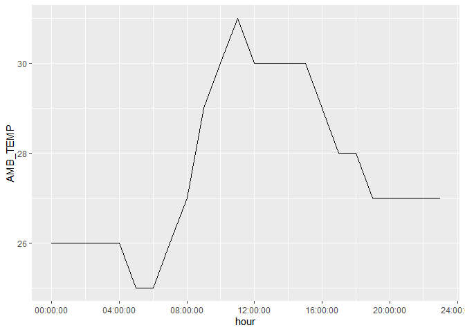
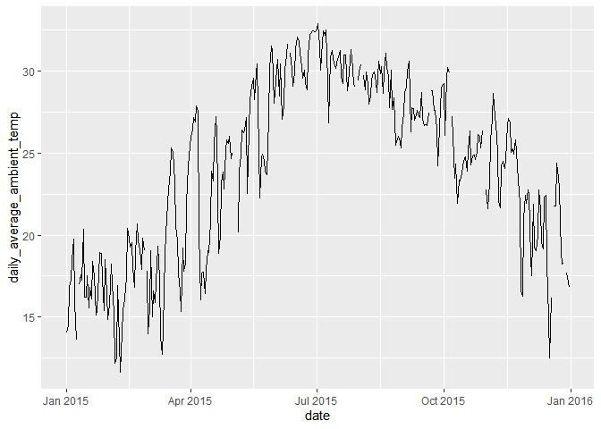
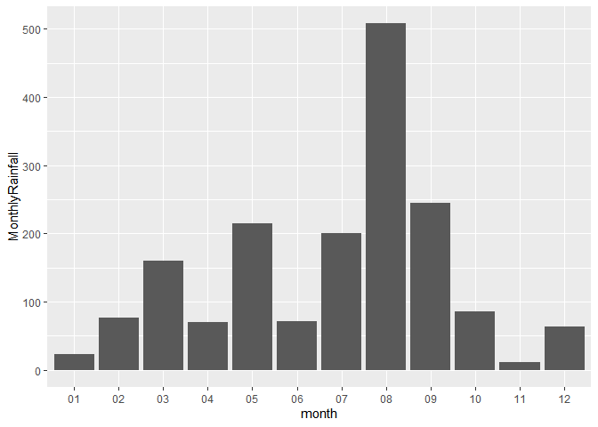
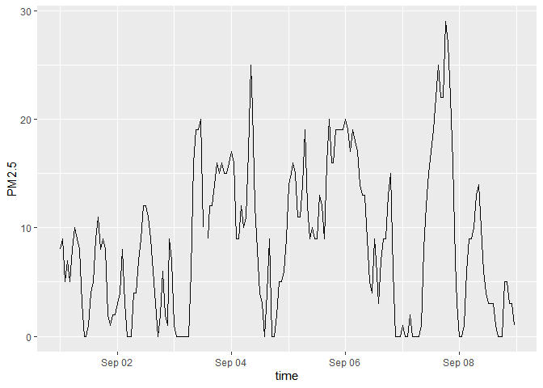

assignment 6
================
Soojung
3/14/2022

### Load Packages

To start, load all the required packages with the following code.
Install them if they are not installed yet.

``` r
library(tidyverse)
library(knitr)
library(dplyr)
library(lubridate)
```

## Exercise 1. Tibble and Data Import

Import the data frames listed below into R and parse the columns
appropriately when needed. Watch out for the formatting oddities of each
dataset. Print the results directly, without using `kable()`.

You only need to finish any three out of the five questions in this
exercise in order to get credit.

<br>

#### 1.1 Create the following tibble manually, first using `tribble()` and then using `tibble()`. Print both results. \[We didn’t have time to cover this in class, but look up how these functions work here\]

`tribble()`:

``` r
tribble(
  ~a, ~b, ~b,
  #---|---|---
  1, 2.1, "apple",
  2, 3.2, "orange"
)
```

    ## # A tibble: 2 x 3
    ##       a     b b     
    ##   <dbl> <dbl> <chr> 
    ## 1     1   2.1 apple 
    ## 2     2   3.2 orange

`tibble()`:

``` r
tibble(
  a = 1:2, 
  b = c(2.1, 3.2), 
  c = c("apple", "orange")
)
```

    ## # A tibble: 2 x 3
    ##       a     b c     
    ##   <int> <dbl> <chr> 
    ## 1     1   2.1 apple 
    ## 2     2   3.2 orange

#### 1.2 Import `https://raw.githubusercontent.com/nt246/NTRES-6100-data-science/master/datasets/dataset2.txt` into R. Change the column names into “Name”, “Weight”, “Price”.

``` r
fruits <- read.delim("https://raw.githubusercontent.com/nt246/NTRES-6100-data-science/master/datasets/dataset2.txt", header=FALSE, sep=",")
names(fruits) = c("Name", "Weight", "Price")

fruits %>%
  as_tibble(fruits)%>%
  mutate(across(Weight, as.double))
```

    ## # A tibble: 3 x 3
    ##   Name   Weight Price
    ##   <chr>   <dbl> <dbl>
    ## 1 apple       1   2.9
    ## 2 orange      2   4.9
    ## 3 durian     10  19.9

#### 1.3 Import `https://raw.githubusercontent.com/nt246/NTRES-6100-data-science/master/datasets/dataset3.txt` into R. Watch out for the first few lines, missing values, separators, quotation marks, and deliminaters.

``` r
fruits2 <- read.delim("https://raw.githubusercontent.com/nt246/NTRES-6100-data-science/master/datasets/dataset3.txt", skip = 3, header = FALSE, sep=";", na = c("?","Not Available"))

names(fruits2) = c("Name", "Weight", "Price")

fruits2 %>%
  mutate(across(Weight, as.double))%>%
  mutate_at("Name", str_replace_all, "/", "")%>%
  as_tibble(fruits2)
```

    ## # A tibble: 3 x 3
    ##   Name   Weight Price
    ##   <chr>   <dbl> <dbl>
    ## 1 apple       1   2.9
    ## 2 orange      2  NA  
    ## 3 durian     NA  19.9

<br>

## Exercise 2. Weather Station

This dataset contains the weather and air quality data collected by a
weather station in Taiwan. It was obtained from the Environmental
Protection Administration, Executive Yuan, R.O.C. (Taiwan).

<br>

#### 2.1 Variable descriptions

-   The text file
    `https://raw.githubusercontent.com/nt246/NTRES-6100-data-science/master/datasets/2015y_Weather_Station_notes.txt`
    contains descriptions of different variables collected by the
    station.

-   Import it into R and print it in a table as shown below with
    kable().

``` r
data_para <- read.delim("https://raw.githubusercontent.com/nt246/NTRES-6100-data-science/master/datasets/2015y_Weather_Station_notes.txt", sep="-")
data_para %>%
  kable()
```

| Item       | Unit    | Description                                               |
|:-----------|:--------|:----------------------------------------------------------|
| AMB_TEMP   | Celsius | Ambient air temperature                                   |
| CO         | ppm     | Carbon monoxide                                           |
| NO         | ppb     | Nitric oxide                                              |
| NO2        | ppb     | Nitrogen dioxide                                          |
| NOx        | ppb     | Nitrogen oxides                                           |
| O3         | ppb     | Ozone                                                     |
| PM10       | μg/m3  | Particulate matter with a diameter between 2.5 and 10 μm |
| PM2.5      | μg/m3  | Particulate matter with a diameter of 2.5 μm or less     |
| RAINFALL   | mm      | Rainfall                                                  |
| RH         | %       | Relative humidity                                         |
| SO2        | ppb     | Sulfur dioxide                                            |
| WD_HR      | degress | Wind direction (The average of hour)                      |
| WIND_DIREC | degress | Wind direction (The average of last ten minutes per hour) |
| WIND_SPEED | m/sec   | Wind speed (The average of last ten minutes per hour)     |
| WS_HR      | m/sec   | Wind speed (The average of hour)                          |

`#` indicates invalid value by equipment inspection `*` indicates
invalid value by program inspection `x` indicates invalid value by human
inspection `NR` indicates no rainfal blank indicates no data

#### 2.2 Data tidying

-   Import
    `https://raw.githubusercontent.com/nt246/NTRES-6100-data-science/master/datasets/2015y_Weather_Station.csv`
    into R. As you can see, this dataset is a classic example of untidy
    data: values of a variable (i.e. hour of the day) are stored as
    column names; variable names are stored in the `item` column.

-   Clean this dataset up and restructure it into a tidy format.

-   Parse the `date` variable into date format and parse `hour` into
    time.

-   Turn all invalid values into `NA` and turn `NR` in rainfall into
    `0`.

-   Parse all values into numbers.

-   Show the first 6 rows and 10 columns of this cleaned dataset, as
    shown below, without using `kable()`.

*Hints: you don’t have to perform these tasks in the given order; also,
warning messages are not necessarily signs of trouble.*

Before cleaning:

``` r
taiwan <- read.csv("https://raw.githubusercontent.com/nt246/NTRES-6100-data-science/master/datasets/2015y_Weather_Station.csv")

taiwan %>%
  as_tibble(taiwan)%>%
  select(1:10) %>%
  head(6)
```

    ## # A tibble: 6 x 10
    ##   date       station item     X00   X01   X02   X03   X04   X05   X06  
    ##   <chr>      <chr>   <chr>    <chr> <chr> <chr> <chr> <chr> <chr> <chr>
    ## 1 2015/01/01 Cailiao AMB_TEMP 16    16    15    15    15    14    14   
    ## 2 2015/01/01 Cailiao CO       0.74  0.7   0.66  0.61  0.51  0.51  0.51 
    ## 3 2015/01/01 Cailiao NO       1     0.8   1.1   1.7   2     1.7   1.9  
    ## 4 2015/01/01 Cailiao NO2      15    13    13    12    11    13    13   
    ## 5 2015/01/01 Cailiao NOx      16    14    14    13    13    15    15   
    ## 6 2015/01/01 Cailiao O3       35    36    35    34    34    32    30

After cleaning:

``` r
taiwan2 = taiwan %>%
  pivot_longer(c("X00":"X23"), names_to = "hour")%>%
  pivot_wider(names_from = item, values_from = value)%>%
  mutate_at("RAINFALL", str_replace_all, "NR", "0")%>%
  na_if("#")%>%
  na_if("*")%>%
  na_if("x")%>%
  mutate(date=parse_date(date))%>%
  mutate_at("hour", str_replace_all, "X", "")%>%
  mutate(hour=parse_time(hour, format="%h")) %>%
  mutate_at(c("AMB_TEMP", "CO", "NO", "NOx", "O3", "PM10", "PM2.5", "RAINFALL", "RH", "SO2", "WD_HR", "WIND_DIREC", "WIND_SPEED"), as.double)


taiwan2 %>%
  as_tibble(taiwan2)%>%
  select(1:10) %>%
  head(6)
```

    ## # A tibble: 6 x 10
    ##   date       station hour   AMB_TEMP    CO    NO NO2     NOx    O3  PM10
    ##   <date>     <chr>   <time>    <dbl> <dbl> <dbl> <chr> <dbl> <dbl> <dbl>
    ## 1 2015-01-01 Cailiao 00:00        16  0.74   1   15       16    35   171
    ## 2 2015-01-01 Cailiao 01:00        16  0.7    0.8 13       14    36   174
    ## 3 2015-01-01 Cailiao 02:00        15  0.66   1.1 13       14    35   160
    ## 4 2015-01-01 Cailiao 03:00        15  0.61   1.7 12       13    34   142
    ## 5 2015-01-01 Cailiao 04:00        15  0.51   2   11       13    34   123
    ## 6 2015-01-01 Cailiao 05:00        14  0.51   1.7 13       15    32   110

#### 2.3 Using this cleaned dataset, plot the daily variation in ambient temperature on September 25, 2015, as shown below.

``` r
taiwan2 %>%
  filter(date == "2015-09-25") %>%
  ggplot(aes(x = hour, y = AMB_TEMP)) +
  geom_line()
```

<!-- -->

#### 2.4 Plot the daily average ambient temperature throughout the year with a continuous line, as shown below.

``` r
gg_base = taiwan2 %>%
  select(date, AMB_TEMP)%>%
  group_by(date) %>%
  summarise_at(vars(AMB_TEMP), funs(mean))%>%
  rename('daily_average_ambient_temp' = AMB_TEMP)

ggplot(data = gg_base, aes(x = date, y = daily_average_ambient_temp))+
  geom_line()
```

<!-- -->

#### 2.5 Plot the total rainfall per month in a bar chart, as shown below.

*Hint: separating date into three columns might be helpful.*

``` r
gg_base2 = taiwan2 %>%
  mutate(month=format(date, "%m")) %>%
  group_by(month)%>%
  summarise_at(vars(RAINFALL), sum, na.rm = TRUE)%>%
  rename('MonthlyRainfall' = RAINFALL)%>%
  ggplot(aes(x = month, y = MonthlyRainfall)) +
  geom_col() 

gg_base2
```

<!-- -->

#### 2.6 Plot the per hour variation in PM2.5 in the first week of September with a continuous line, as shown below.

*Hint: uniting the date and hour and parsing the new variable might be
helpful.*

``` r
taiwan2 %>%
  filter(date >= "2015-09-01" & date <= "2015-09-08")%>%
  select(date, hour, PM2.5)%>%
  unite("time", date, hour) %>%
  mutate(time=parse_datetime(time, format = "%Y-%m-%d_%H:%M:%S"))%>%
  ggplot(aes(x = time, y = PM2.5))+
  geom_line()
```

<!-- -->
